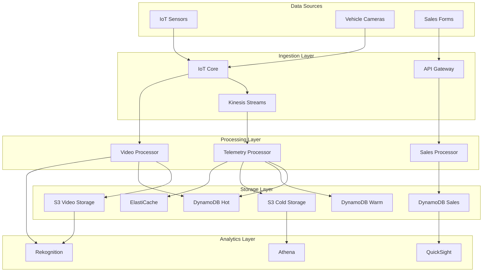

# Análisis de Arquitectura de Datos - IoT y Formularios

## 🎯 Estrategia de Almacenamiento por Tipo de Dato

### 1. **Datos de Sensores IoT - Estrategia Híbrida**

#### Flujo de Datos Propuesto:
```
Sensores IoT → IoT Core → Kinesis → Lambda → [Hot/Warm/Cold Storage]
```

#### **Hot Storage (Tiempo Real - 24-48 horas)**
- **Tecnología**: DynamoDB + ElastiCache
- **Propósito**: Consultas en tiempo real, alertas, dashboard
- **TTL**: 48 horas
- **Estructura**:
```json
{
  "vehicle_id": "VH001",
  "timestamp": "2025-01-25T10:30:00.000Z",
  "ttl": 1706270400,
  "data": {
    "location": {...},
    "engine": {...},
    "diagnostics": {...}
  }
}
```

#### **Warm Storage (Análisis Reciente - 30 días)**
- **Tecnología**: DynamoDB con GSI por fecha
- **Propósito**: Reportes, análisis de tendencias
- **Particionado**: Por vehicle_id + fecha
- **Estructura**:
```json
{
  "pk": "VH001#2025-01-25",
  "sk": "10:30:00.000Z",
  "vehicle_id": "VH001",
  "date": "2025-01-25",
  "timestamp": "2025-01-25T10:30:00.000Z",
  "aggregated_data": {...}
}
```

#### **Cold Storage (Histórico - >30 días)**
- **Tecnología**: S3 + Athena/Redshift Spectrum
- **Propósito**: Análisis histórico, ML, compliance
- **Formato**: Parquet particionado por año/mes/día
- **Estructura**:
```
s3://bucket/telemetry/year=2025/month=01/day=25/hour=10/
├── vehicle_telemetry_2025012510.parquet
```

### 2. **Datos de Cámaras - Estrategia Especializada**

#### Flujo de Video:
```
Cámaras → IoT Core → S3 → Lambda → [Rekognition/Processing]
```

#### **Almacenamiento de Video**:
- **Tecnología**: S3 con Intelligent Tiering
- **Estructura**:
```
s3://video-bucket/
├── raw/vehicle_id/year/month/day/hour/
│   └── VH001_20250125_103000.mp4
├── processed/vehicle_id/year/month/day/
│   └── VH001_20250125_events.mp4
└── thumbnails/vehicle_id/year/month/day/
    └── VH001_20250125_103000.jpg
```

#### **Metadatos de Video en DynamoDB**:
```json
{
  "video_id": "VH001_20250125_103000",
  "vehicle_id": "VH001",
  "timestamp": "2025-01-25T10:30:00.000Z",
  "s3_location": "s3://bucket/raw/VH001/2025/01/25/10/VH001_20250125_103000.mp4",
  "duration": 300,
  "size_bytes": 52428800,
  "events_detected": ["harsh_braking", "speed_violation"],
  "processed": true,
  "retention_until": "2025-07-25T10:30:00.000Z"
}
```

### 3. **Formularios de Agentes de Ventas - DynamoDB Optimizado**

#### Características de Datos de Ventas:
- **Volumen**: Bajo-Medio (cientos/miles por día)
- **Complejidad**: Alta (relaciones, validaciones)
- **Consultas**: CRUD tradicional + reportes
- **Consistencia**: Fuerte (transaccional)

#### **Estructura Recomendada en DynamoDB**:

##### **Tabla: Sales-Transactions**
```json
{
  "pk": "CLIENT#CLI001",
  "sk": "CONTRACT#CT001",
  "entity_type": "contract",
  "contract_id": "CT001",
  "client_id": "CLI001",
  "agent_id": "AGT001",
  "created_at": "2025-01-25T10:30:00.000Z",
  "status": "pending_approval",
  "contract_data": {
    "vehicle_count": 25,
    "monthly_fee": 15000.00,
    "services": ["GPS", "Maintenance", "Monitoring"],
    "start_date": "2025-02-01",
    "end_date": "2026-01-31"
  },
  "gsi1pk": "AGENT#AGT001",
  "gsi1sk": "2025-01-25T10:30:00.000Z",
  "gsi2pk": "STATUS#pending_approval",
  "gsi2sk": "2025-01-25T10:30:00.000Z"
}
```

##### **Tabla: Sales-Clients**
```json
{
  "pk": "CLIENT#CLI001",
  "sk": "PROFILE",
  "entity_type": "client",
  "client_id": "CLI001",
  "company_name": "Empresa Logística ABC",
  "contact_info": {
    "name": "Carlos Rodríguez",
    "email": "carlos@logisticaabc.com",
    "phone": "+52-55-1234-5678"
  },
  "address": {...},
  "created_by": "AGT001",
  "created_at": "2025-01-25T10:30:00.000Z",
  "gsi1pk": "AGENT#AGT001",
  "gsi1sk": "CLIENT#CLI001"
}
```

## 🏗️ Arquitectura de Datos Recomendada

### Diagrama de Flujo de Datos:



## 📈 Consideraciones de Performance y Costo

### **Sensores IoT (70 vehículos, 30 seg intervals)**
- **Volumen**: ~201,600 registros/día
- **DynamoDB Hot**: $15-20/mes
- **S3 Cold**: $2-5/mes
- **Procesamiento**: $5-10/mes

### **Video (70 vehículos, 8 horas/día)**
- **Volumen**: ~2TB/mes
- **S3 Storage**: $50-70/mes
- **Processing**: $20-30/mes
- **Rekognition**: $100-150/mes (si se usa)

### **Formularios de Ventas**
- **Volumen**: ~1,000 transacciones/mes
- **DynamoDB**: $5-10/mes
- **Processing**: $1-2/mes

## 🔧 Implementación Técnica

### 1. **Configuración de TTL para Hot Storage**
```hcl
resource "aws_dynamodb_table" "telemetry_hot" {
  name           = "${var.project_name}-telemetry-hot"
  billing_mode   = "PAY_PER_REQUEST"
  hash_key       = "vehicle_id"
  range_key      = "timestamp"

  ttl {
    attribute_name = "ttl"
    enabled        = true
  }

  attribute {
    name = "vehicle_id"
    type = "S"
  }

  attribute {
    name = "timestamp"
    type = "S"
  }
}
```

### 2. **Lambda para Procesamiento de Telemetría**
```python
import json
import boto3
from datetime import datetime, timedelta

def lambda_handler(event, context):
    dynamodb = boto3.resource('dynamodb')
    s3 = boto3.client('s3')
    
    for record in event['Records']:
        # Parse IoT message
        payload = json.loads(record['body'])
        
        # Hot storage (DynamoDB with TTL)
        hot_table = dynamodb.Table('telemetry-hot')
        hot_item = {
            'vehicle_id': payload['vehicle_id'],
            'timestamp': payload['timestamp'],
            'ttl': int((datetime.now() + timedelta(hours=48)).timestamp()),
            'data': payload
        }
        hot_table.put_item(Item=hot_item)
        
        # Cold storage (S3 for historical analysis)
        if should_archive(payload):
            s3_key = f"telemetry/year={payload['year']}/month={payload['month']}/day={payload['day']}/{payload['vehicle_id']}_{payload['timestamp']}.json"
            s3.put_object(
                Bucket='telemetry-cold-storage',
                Key=s3_key,
                Body=json.dumps(payload)
            )
```

### 3. **Optimización de Consultas de Ventas**
```python
# Consulta eficiente por agente
def get_contracts_by_agent(agent_id, limit=50):
    response = dynamodb.query(
        TableName='sales-transactions',
        IndexName='GSI1',
        KeyConditionExpression='gsi1pk = :agent_id',
        ExpressionAttributeValues={
            ':agent_id': f'AGENT#{agent_id}'
        },
        ScanIndexForward=False,  # Más recientes primero
        Limit=limit
    )
    return response['Items']

# Consulta por estado de contrato
def get_contracts_by_status(status):
    response = dynamodb.query(
        TableName='sales-transactions',
        IndexName='GSI2',
        KeyConditionExpression='gsi2pk = :status',
        ExpressionAttributeValues={
            ':status': f'STATUS#{status}'
        }
    )
    return response['Items']
```

## 🎯 Recomendaciones Finales

### **Para Sensores IoT:**
- ✅ **DynamoDB para Hot Storage** (24-48 horas)
- ✅ **S3 + Athena para Cold Storage** (>30 días)
- ✅ **ElastiCache para consultas frecuentes**

### **Para Cámaras:**
- ✅ **S3 para almacenamiento de video**
- ✅ **DynamoDB para metadatos**
- ✅ **Rekognition para análisis automático**

### **Para Formularios de Ventas:**
- ✅ **DynamoDB es IDEAL** para este caso
- ✅ **Estructura single-table con GSIs**
- ✅ **Transacciones para consistencia**

Esta arquitectura híbrida optimiza costos, performance y escalabilidad según las características específicas de cada tipo de dato.
